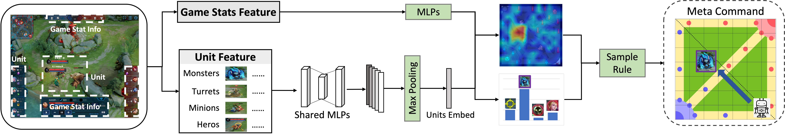
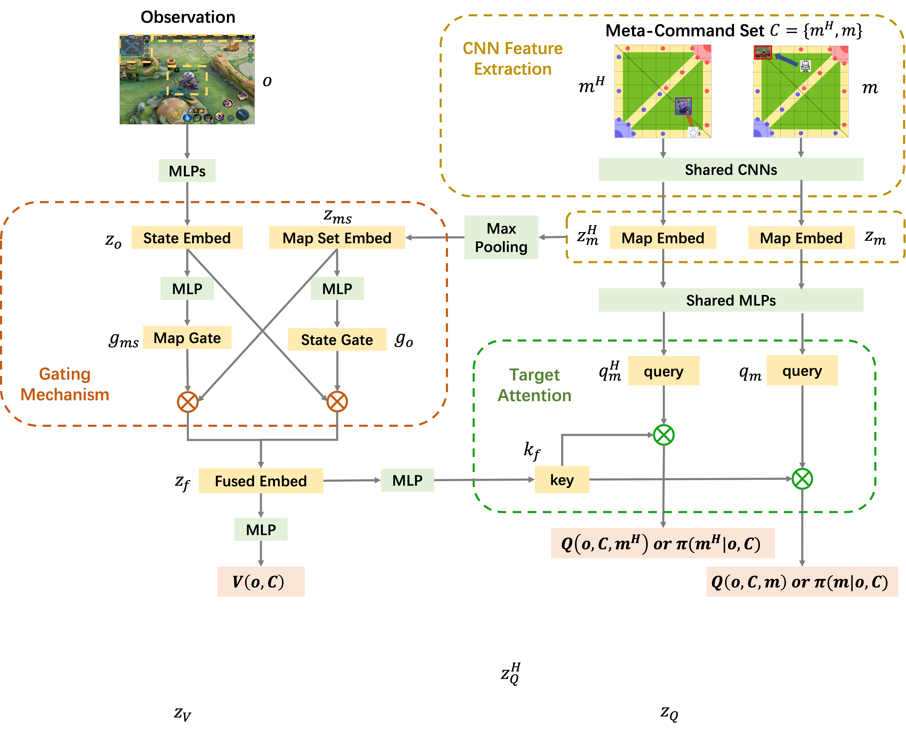
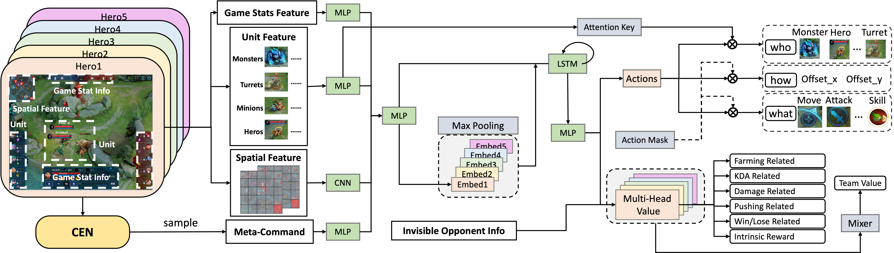

# MCC —— Towards Effective and Interpretable Human-Agent Collaboration in MOBA Games: A Communication Perspective
## Paper Link
- https://openreview.net/pdf?id=q3F0UBAruO

## Environmental Requirements
- numpy == 1.18.5
- tensorflow == 1.15.5

## Detailed Model Structure
- CEN.py

- CS.py

- MCCAN.py


## Demo
- Since the game engine and data are private and confidential, all data is faked using ```fake_data.py```.
- For infer:
  - ``` python infer.py ```
- For train:
  - ``` python train_CEN.py ```
  - ``` python train_CS.py ```
  - ``` python train_MCCAN.py ```

## BibTeX
@inproceedings{
gao2023towards,
title={Towards Effective and Interpretable Human-Agent Collaboration in {MOBA} Games: A Communication Perspective},
author={Yiming Gao and Feiyu Liu and Liang Wang and Zhenjie Lian and Weixuan Wang and Siqin Li and Xianliang Wang and Xianhan Zeng and Rundong Wang and jiawei wang and QIANG FU and Yang Wei and Lanxiao Huang and Wei Liu},
booktitle={The Eleventh International Conference on Learning Representations },
year={2023},
url={https://openreview.net/forum?id=q3F0UBAruO}
}
