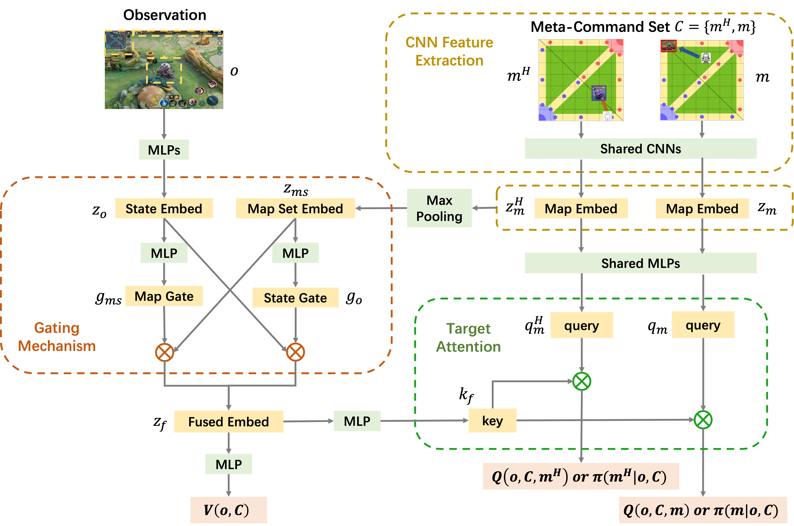

# MCC —— Towards Effective and Interpretable Human-Agent Collaboration in MOBA Games: A Communication Perspective

## Environmental Requirements
- numpy == 1.18.5
- tensorflow == 1.15.5

## Detailed Model Structure
- CEN.py

- CS.py

- MCCAN.py


## Demo
- Since the game engine and data are private and confidential, all data is faked using ```fake_data.py```.
- For infer:
  - ``` python infer.py ```
- For train:
  - ``` python train_CEN.py ```
  - ``` python train_CS.py ```
  - ``` python train_MCCAN.py ```
